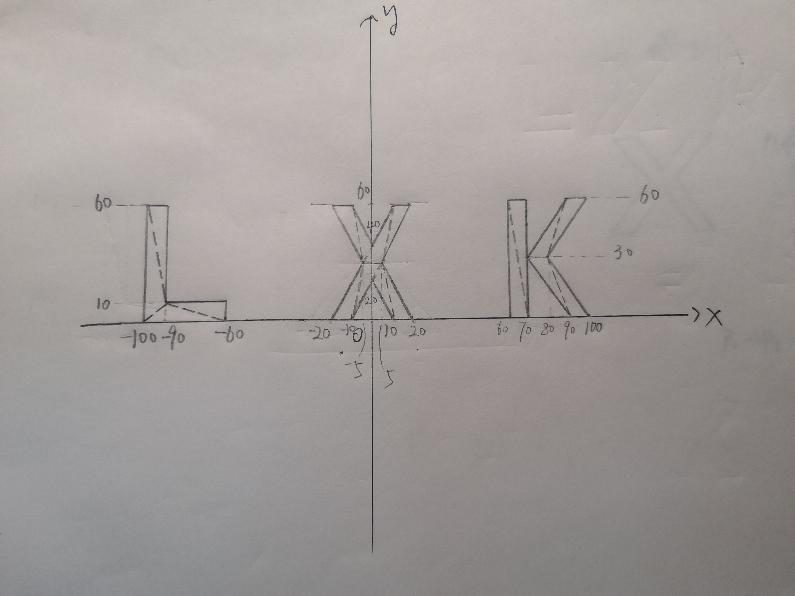
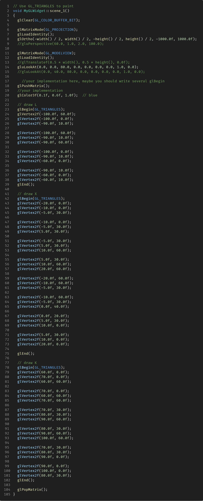
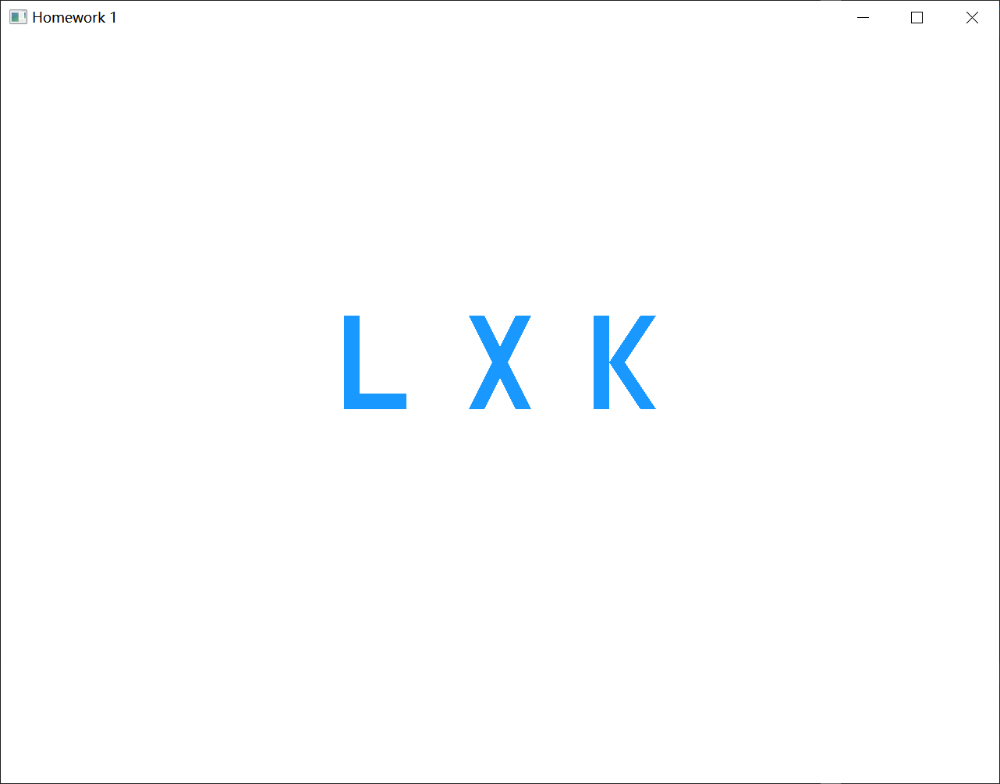
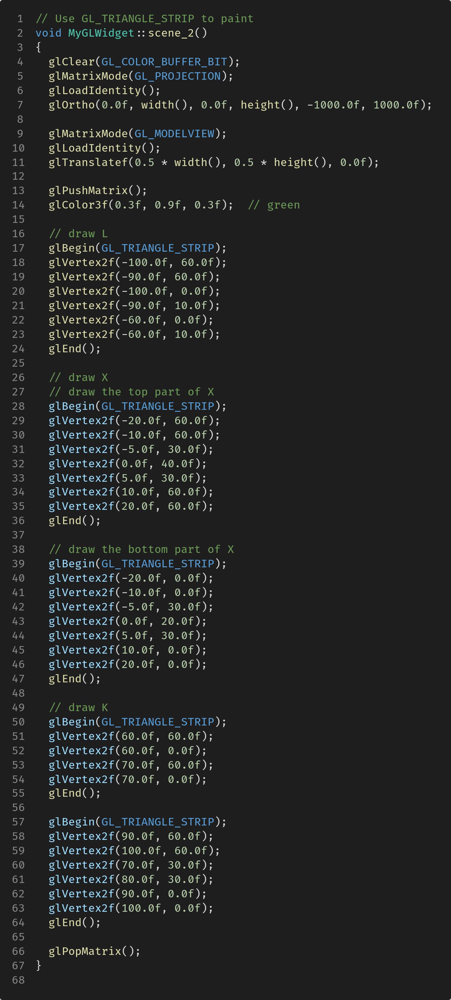
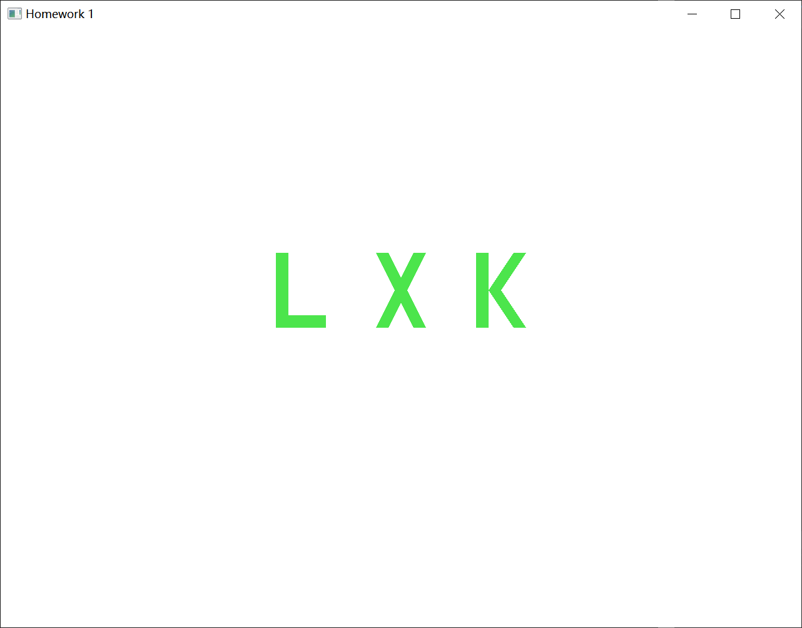
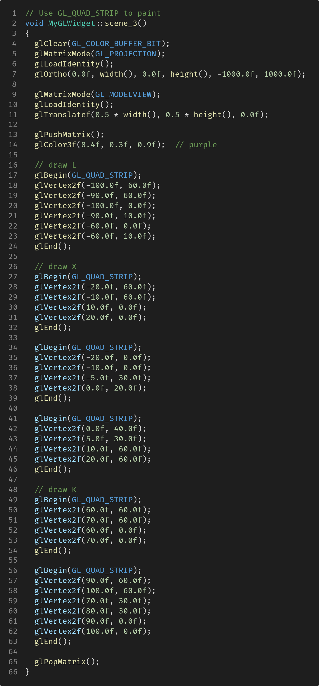
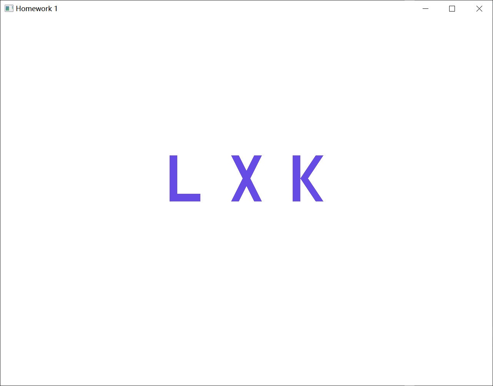
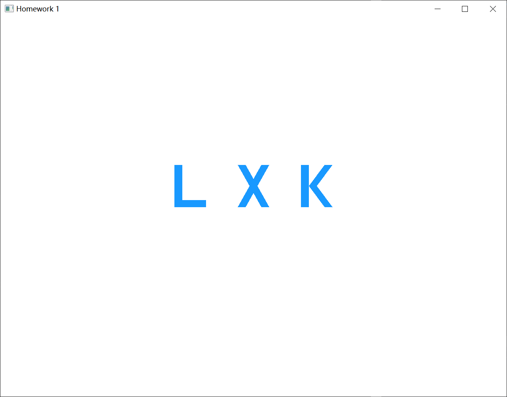
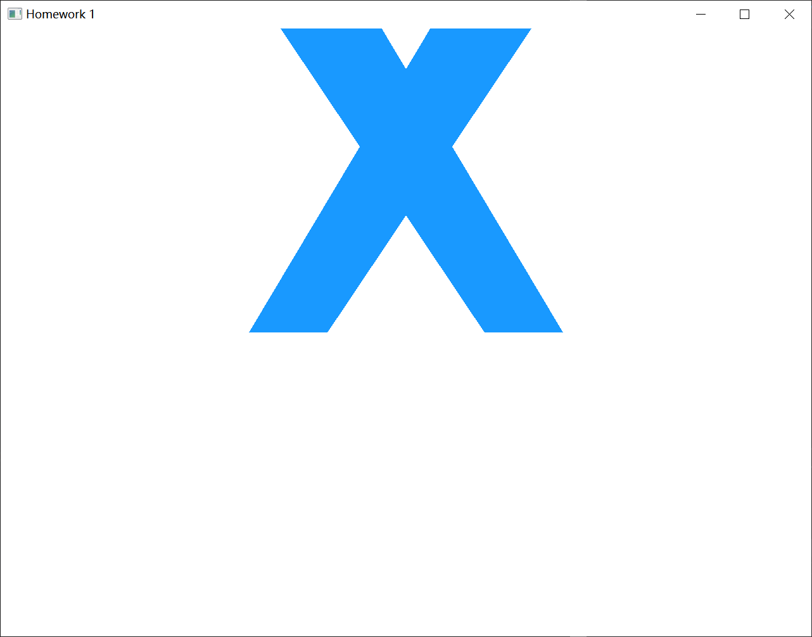

# HW1

|                                    |                        |
| :--------------------------------- | :--------------------- |
| 学号：19335109                 | 课程：计算机图形学 |
| 姓名：李雪堃                   | 学期：Fall 2021    |
| 专业：计算机科学与技术（超算） | 教师：陶钧         |
| 邮箱：i@xkun.me              | TA：席杨         |

---

*Table of Contents*

[toc]


---

## (一) 字体的设计和绘制

首先，设计姓名首字母的字体，确定合适的大小和具体的形状。L、X、K 等宽，宽度为 40，字体的粗细为 10。下图是字体在 XOY 平面上的具体位置。



接下来，就可以直接按照上图对字母进行绘制了。作业模板给出的代码是先在原点处绘制，然后平移到窗口的中央，我对其稍作了修改，修改正交投影的 volume，然后用 `gluLookAt` 直接从 Z 轴负方向看向原点，效果是一样的，而且方便我们之后的投影变换。

下面是使用 `GL_TRIANGLES` 绘制的代码。



编译运行后，按 "1" 键切换到 scene_1。效果图如下。



然后使用 `GL_TRIANGLE_STRIP` 进行绘制。刚开始我没搞懂该图元与 `GL_TRIANGLES` 的区别，查阅和参考了一些资料才知道，`GL_TRIANGLE_STRIP` 会将每次绘制的三角形的最后两个顶点形成的边，作为下一个三角形的一条边。也就是一个三角形像是从先前的三角形上 “生长” 出来一样。

比如说下面的例子，第一个绘制的三角形是 p1-p2-p3，接着会以 p2-p3 作为下一个三角形的一条边，于是下一个三角形就是 p2-p3-p4。不断地取 3 个顶点进行绘制，这样就可以绘制多边形。这也需要我们提前规划好绘制的顺序，否则容易出问题。

```C++
glBegin(GL_TRIANGLE_STRIP);
	glVertex2f(p1);
	glVertex2f(p2);
	glVertex2f(p3);
	glVertex2f(p4);
glEnd();
```

下面是使用 `GL_TRIANGLE_STRIP` 绘制的代码。X 有交叉，无法一次画完，所以分上下两部分画。K 本身设计的字体是分为两部分的，所以也要分两次画。



编译运行后，按 "2" 键切换到 scene_2。效果图如下。



最后使用 `GL_QUAD_STRIP` 进行绘制，它的特点与 `GL_TRIANGLE_STRIP` 相同，不过它每次画的不是三角形，而是四边形，所以需要 4 个点。

下面是使用 `GL_QUAD_STRIP` 绘制的代码。



编译运行后，按 "3" 键切换到 scene_3。效果图如下。



经过统计，三种绘制方法调用 `glVertex2f` 的次数分别是：

- `GL_TRIANGLES`: 48
- `GL_TRIANGLE_STRIP`: 30
- `GL_QUAD_STRIP`: 28

可以看到，后两种方法明显要比第一种方法的绘制效率要高不少，但需要预先的规划。

## (二) 投影和视角的变换

- 视角一：
  - eye (0, 0, d)
  - center (0, 0, 0)
  - up (0, 1, 0)
- 视角二：
  - eye (0, 0.5d, d)
  - center (0, 0, 0)
  - up (0, 1, 0)

我们取 d = 80.0，并且以用 `GL_TRIANGLES` 绘制的蓝色 LXK 为例。

正交投影下两个视角的对比：

| 视角一                             | 视角二                                               |
| ---------------------------------- | ---------------------------------------------------- |
|  |  |

可以看到，视角二下的 LXK 比视角一下的 LXK 稍微 “扁” 一点点。因为视角二相当于在视角一的正上方，视角一相当于正对 LXK。

透视投影下两个视角的对比：

| 视角一                              | 视角二                              |
| ----------------------------------- | ----------------------------------- |
|  |  |

透视投影设置角度是 60 度，aspect 为 1.0，znear 为 2.0，zfar 为 100.0。

透视投影下两个视角的区别比正交投影下更为明显。视角二下的字体比视角一要稍 “瘦” 一点，而且倾斜的角度有些不同。

## (三) 总结

这次作业学习到了 OpenGL 基本图元的绘制方法的特点，还有正交投影和透视投影的区别。正交投影的 volume 是一个长方体，如果从正面看就可以看到全面的图形；透视投影的 volume 是一个锥台，会将图形进行缩放和剪切，一般会看到图形的一部分而不是全部。`gluLookAt` 可以很方便地调整照相机的位置。

