# HW2：沿固定路线运动的机器人

|                                |                    |
| :----------------------------- | :----------------- |
| 学号：19335109                 | 课程：计算机图形学 |
| 姓名：李雪堃                   | 学期：Fall 2021    |
| 专业：计算机科学与技术（超算） | 教师：陶钧         |
| 邮箱：i@xkun.me                | TA：席杨           |

---

*Table of Contents*

[toc]

---

## (一) 机器人的设计和绘制

下面是机器人形状设计的草图（画的比较丑）。我的机器人名字是 kbot，原型是 Minecraft 中的 Steve（配色大概相同，低配版 Steve）。kbot 将绕一固定转轴做圆周运动，四肢在运动过程中进行摆动。

kbot 由下面的部件组成：

- 头部：1.0 x 1.0 x 1.0 的正方体（不是图中的 0.8）
- 身体：4 x 2 x 1 的长方体
- 手臂：2 x 0.5 x 0.5 的长方体
- 腿：2 x 0.5 x 0.5 的长方体（和手臂形状相同）

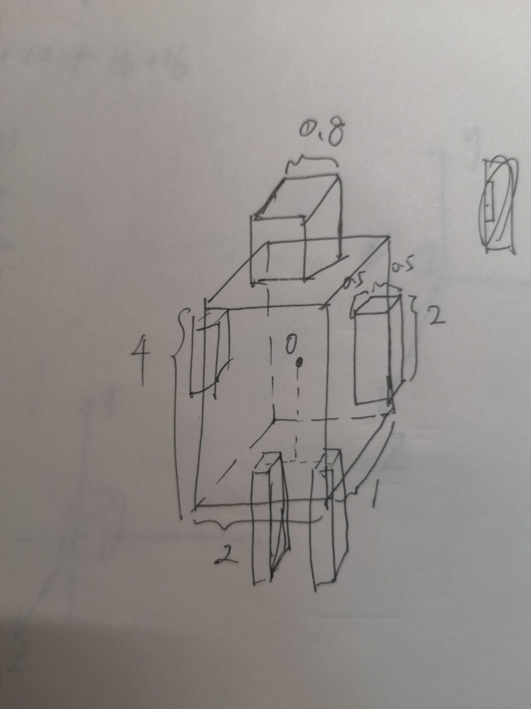

在考虑机器人沿路线运动、机器人四肢的摆动这两个问题之前，我们先把机器人绘制出来。

在 `myglwidget.h` 的 `MyGLWidget` 类中添加绘制机器人躯干和四肢的成员函数。另外，添加机器人旋转角度（机器人绕圆圈运动）、以及四肢摆动角度的成员变量。

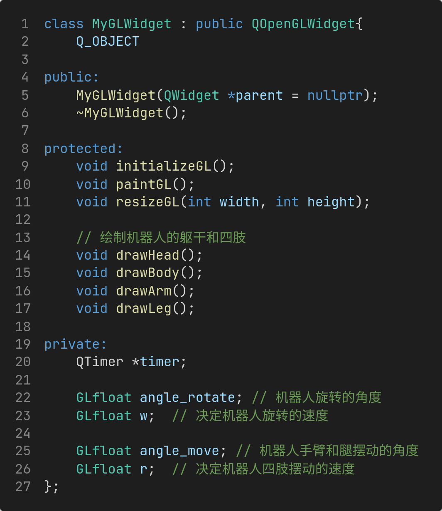

然后，实现机器人的绘制函数。首先是机器人的身体，使用 `GL_QUADS` 绘制，分别绘制 body 的 6 个面。`drawBody` 默认是以 body 的中心作为坐标原点进行绘制的。

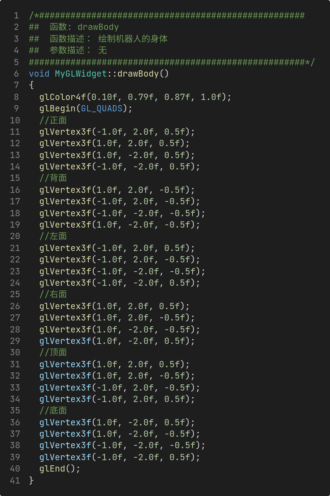

然后是机器人头部的绘制，`drawHead` 同样默认以脑袋中心为坐标原点进行绘制。

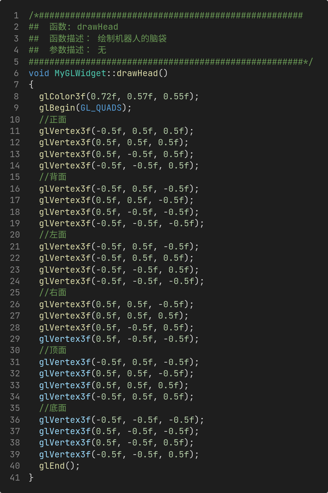

最后是机器人手臂和腿的绘制。由于我设计机器人手臂和腿的形状一样，所以两个绘制的部分是一样的，只是颜色不一样。

还要注意的是，手臂和腿都不是以它们的中心为坐标原点进行绘制的，而是以它们顶部的中心为坐标原点，原因在最后遇到的问题有说。目的是为了让机器人四肢摆动的姿势看起来更加合理自然，在我的代码实现中，如果以中心为原点绘制，旋转的中心也会是它们的中心，看起来很奇怪。而以顶部中心为原点绘制，比较符合真实人体，看起来效果好很多。

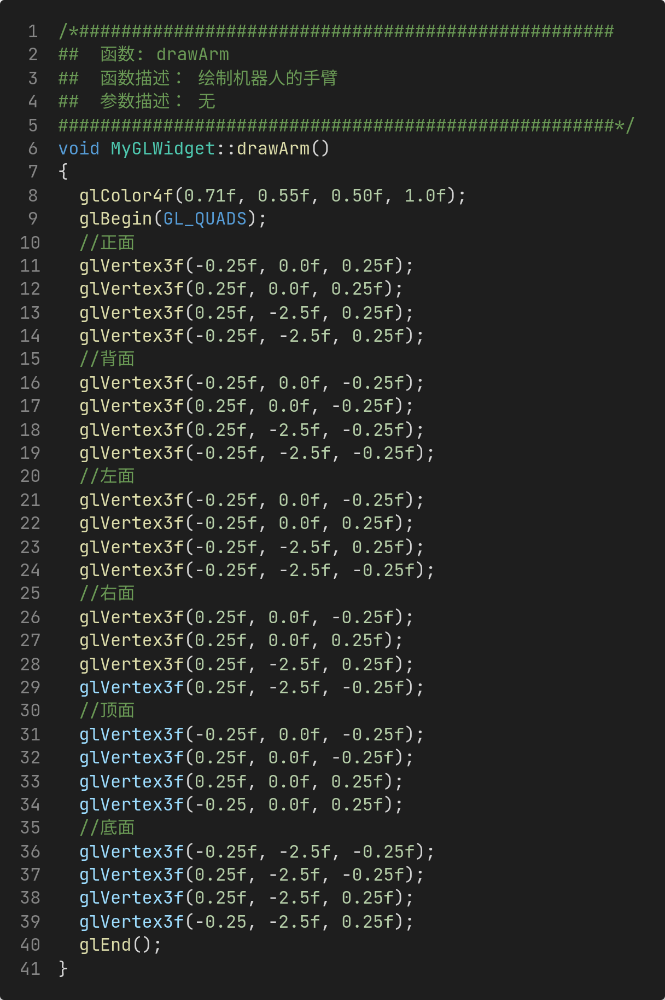

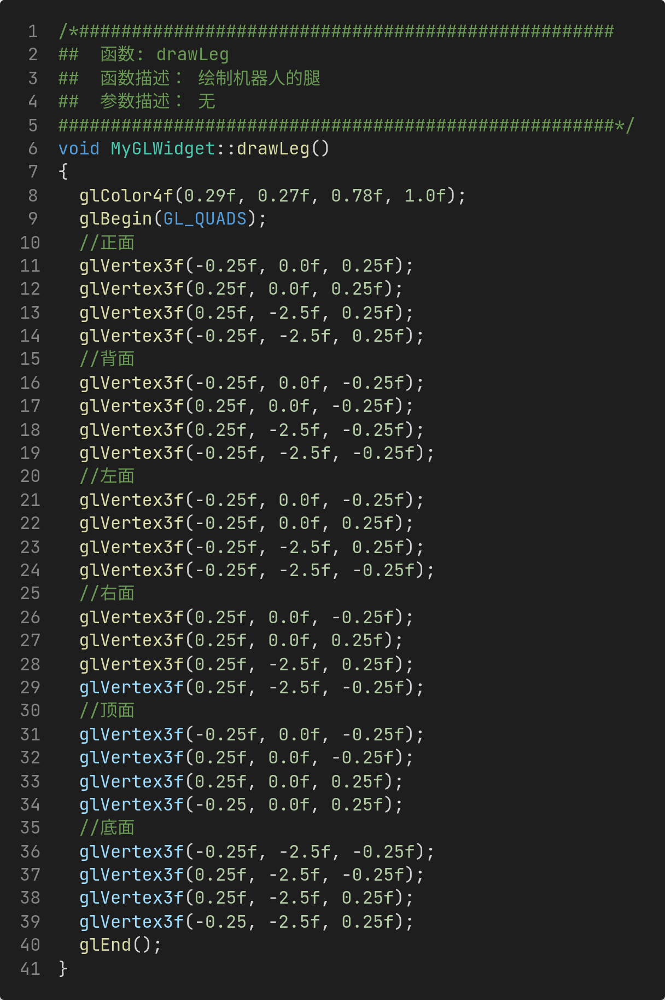

## (二) 机器人绕圆圈运动的实现

接下来是程序的主要逻辑。

首先，需要在 `MyGLWidget` 类的构造函数中对角度和速度进行初始化。

机器人绕圆周的运动：

- `angle_rotate` 是机器人绕圆周旋转的角度，也就是机器人整体做旋转变换的角度。
- `w` 是机器人运动的角速度，时间间隔是 16ms，也就是每隔 16ms 旋转 0.05 度。

机器人四肢的摆动：

- `angle_move` 是机器人四肢摆动的角度，也就是机器人四肢做旋转变换的角度。
- `r` 是机器人四肢摆动的角速度，每隔 16ms 摆动 0.5 度。

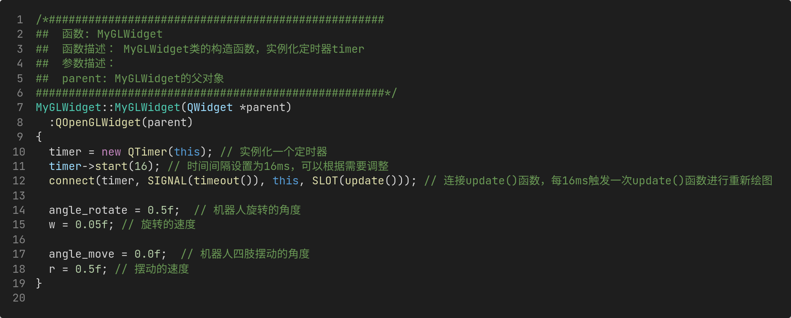

还要注意在 `initializeGL` 函数中开启 OpenGL 的深度测试，否则动画会看起来不真实。

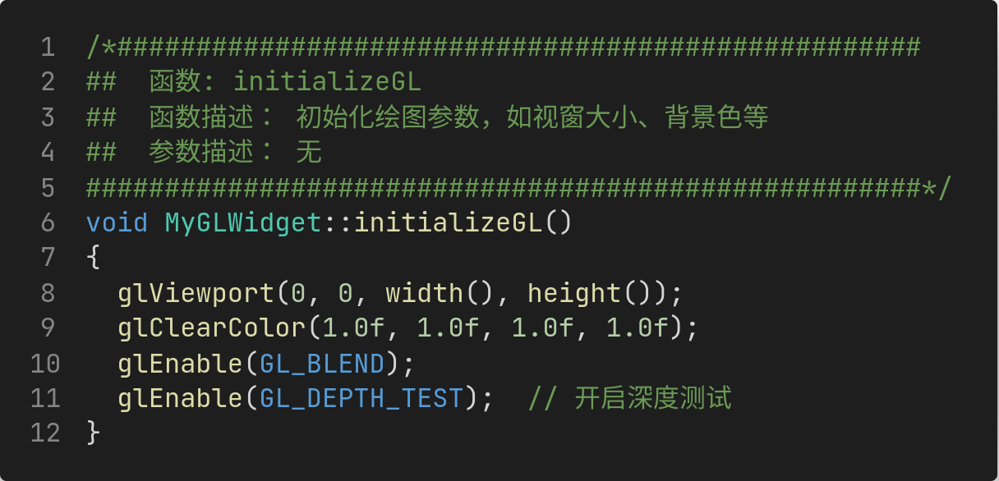

最后，我们需要在 `paintGL` 函数中实现绘图的主要逻辑。

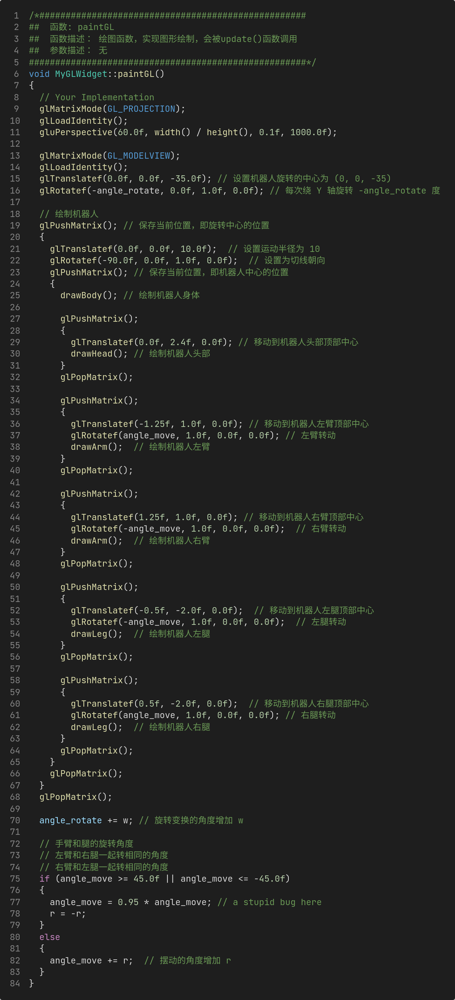

- 首先，在 9 ～ 11 行，设置投影矩阵，设置为透视投影，注意要先调用 `glMatrixMode(GL_PROJECTION)`。在 13 ～ 16 行，设置矩阵类型为 `GL_MODELVIEW`，使用 `glTranslatef` 设置机器人旋转的中心，再进行旋转变换，绕 Y 轴顺时针旋转 `angle_rotate`（逆时针旋转 -angle_rotate 度）。实际上，OpenGL 使用矩阵栈，所以是先进行旋转变换，再进行平移变换的。
- 接下来，绘制机器人，我们首先将当前矩阵状态 push 到栈中，再设置机器人的位置 ，先设置运动方向，`-90.0f` 表示沿切线方向，然后进行平移，向 Z 轴正方向平移 `10.0f`，即机器人运动的半径为 10。
- 注意到，此时坐标已经变换到了机器人的中心，所以我们需要 push 矩阵，否则后面的绘制会出问题。
- 然后绘制机器人的身体和四肢。
  - 身体就以机器人中心为原点绘制，所以不需要 push 矩阵，直接画就好了。
  - 头部需要先移动到头部中心，再进行绘制，所以要 push 矩阵状态，作平移变换到头部中心，在进行绘制。
  - 机器人的双臂和双腿都需要移动到它们的顶部中心，再进行绘制。不仅如此，我们在平移之前，还要进行旋转变换，旋转轴为 X 轴，因为我们的机器人是面朝 Z 轴正方向的。而机器人的左臂和右腿每次 step 摆动的角度相同（右臂和左腿也是一样）。
- 最后是机器人旋转角度、四肢摆动角度的更新，这样才能做成动画的效果，让机器人运动起来。
  - `angle_rotate` 每次增加 `w` 即可。
  - `angle_move` 不能简单地增加，如果一直增加，那么机器人的四肢就变成大风车一直转了，需要设置一个摆动的最大角度，我这里设置为 45 度。在更新 `angle_move` 时，首先判断 `angle_move` 是否超过 45 度（或小于 -45 度），如果超过，则置 `angle_move` 为原来的 0.95 倍，然后设置 `r` 为 `-r`，因为此时每个肢体要往回摆了。

下面是程序运行时的截图。我还录制了视频 `robot.mp4`，建议用 VLC 打开观看。

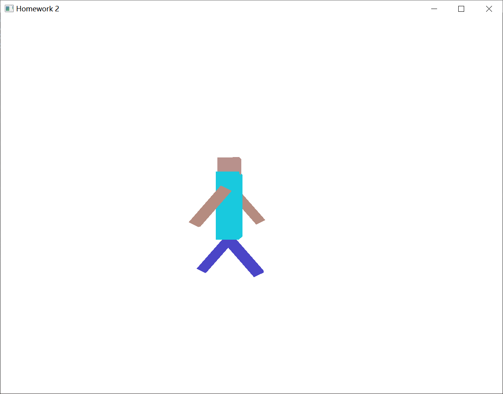

## (四) 遇到的问题和总结

遇到的问题：

- 视角的设置和矩阵变换，`glPushMatrix` 会将当前矩阵入栈，也就是你做的变换会生效，没 push 之前还是原来的坐标，我搞了很久才明白，我在绘制机器人之前，没有 push，于是首先画了机器人的身体和头部，这都没有问题，但是在画机器人的双臂时，我一运行程序，发现机器人的头和身体在一起绕中心旋转，而两个手臂漂浮在旋转中心自转，因为我在设置机器人中心后没有 push，所以后面 pop 完坐标是回到了旋转中心；`glPopMatrix` 会回到变换之前的坐标，也就是 push 前。

- 在实现机器人四肢的旋转时，我开始是以四肢的中心，也就是长方体的中心为旋转轴的，因为我的绘制函数是以中心为原点进行绘制的，造成下面的结果：

  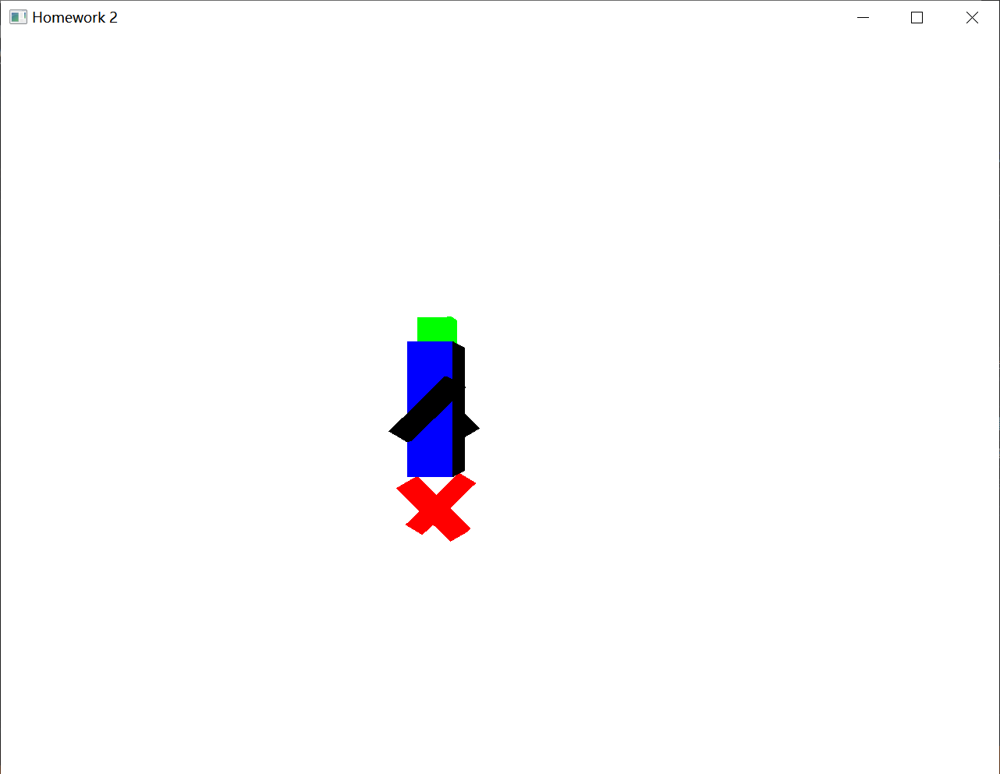

  四肢的摆动很奇怪不自然，所以我马上想到以顶部为坐标原点，因此修改了绘制函数和 `glTranslatef` 的参数，最后效果就好很多。

- 在更新四肢摆动的角度 `angle_move` 时，检测到 `angle_move` 超出范围后，我没有将它减少（设置为 0.95 倍），仅仅将 `r = -r`，而下个 timestep 时，`angle_move` 还是原来的值（仍然超出），程序运行后就会出现机器人四肢摆动一次后不动了，这个 bug 困扰了我一会，写程序要细心。

总结：

这次作业让我熟悉了 OpenGL 各种矩阵的变换、以及视角的变换，知道了 OpenGL 矩阵栈的原理，如何使用 `glPushMatrix` 和 `glPopMatrix` 进行坐标的变换和恢复，收获很大。

