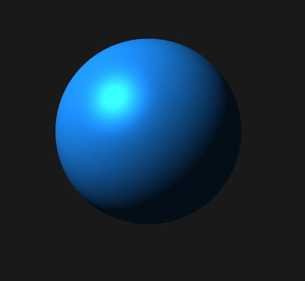

# HW3：GLSL及VBO入门

|                                |                    |
| :----------------------------- | :----------------- |
| 学号：19335109                 | 课程：计算机图形学 |
| 姓名：李雪堃                   | 学期：Fall 2021    |
| 专业：计算机科学与技术（超算） | 教师：陶钧         |
| 邮箱：i@xkun.me                | TA：席杨           |

---

*Table of Contents*

[toc]

---

## (一) 作业要求

- 绘制一系列沿固定轨迹运动的小球（如太阳系）

- 通过GLSL实现Phong-shading

  - 比较Phong-shading与OpenGL自带的flat与smooth shading的区别

  - 可选做：比较Blinn-Phong shading与Phong shading的区别

- 使用VBO对小球进行绘制
  - 使用足够的细分产生充足的顶点和三角面片，便于计算绘制时间
  - 比较不同细分层级下shading的区别
  - 讨论是否使用VBO及index array的效率区别

## (二) 核心代码和过程

### (1) 球体类 Sphere

`Sphere` 类的代码在 `include/Sphere.h` 和 `src/Sphere.cpp` 下。

在 `Sphere.h`，声明一个 `Sphere` 类，用于存储球体的顶点数据（位置向量、法向量）。构造函数根据细分层级构造球体，并绑定 VAO、VBO、EBO，生成顶点数据。析构函数会对 VAO、VBO、EBO 解绑。

`draw()` 使用 VAO 绘制球体，而 `draw_oldschool()` 使用 `glBegin()` 和 `glEnd()` 绘制。

球体坐标按照球的参数方程来分解。对于球上一点 $p(x, y, z)$，可以用 $(u, v)$ 参数方程来表示。
$$
\begin{cases}
x &= r\sin{(\pi v)}\sin{(2 \pi u)} \\
y &= r\cos{(\pi v)} \\
z &= r\sin{(\pi v)}\cos{(2 \pi u)} \\
\end{cases}
$$
其中，$r$ 是球体半径，球心为 $(0, 0, 0)$。$\pi v$ 是点 $p$ 与球心（即原点）连线与 Y 轴正向的夹角，$2\pi u$ 表示 $p$ 在 X-Z 平面上的投影与 Z 轴正向的夹角，且 $u$ 和 $v$ 满足 $u, v \in [0, 1]$。那么，我们在细分球面时，就可以将 v 和 u 进行细分，带入参数方程就可以得到顶点的坐标。比如说设置 $u$ 和 $v$ 的细分层级为 32，那么 $u$ 和 $v$ 将被分成 $\displaystyle 0, \frac{1}{32}, \dots, \frac{31}{32}, 1$。

另外，还需要求出我们细分的所有点的法向量，用于光照模型中计算反射光。

如果我们就将原点作为球心，法向量实际上就和点的坐标相同，不需要用叉积计算了。做平移和旋转变换就可以让球呈现在我们想要的位置。

但是，这种方法需要在 vertex shader 中重新计算法向量，传递给 fragment shader，因为变换后实际的法向量肯定会不一样。

下面是细分球面的代码，是 `Sphere` 类的构造函数。在细分时，按照我们的想法，位置向量和法向量就是一样的。然后在计算顶点索引时，要注意分奇偶行。最后将顶点坐标和法向量存储在 `sphere_vertices` 中，每六个一组绘制。

用 VAO 绘制球面。

用 `glBegin` 和 `glEnd` 绘制球面。

### (2) 不同 Shading 的实现

#### (2-1) Phong Shading and Blinn-Phong Shading

vertex shader 中传入 mvp 三个矩阵，然后对坐标做变换后传递给 fragment shader。

法线需要用法线矩阵来计算，即 model 矩阵左上角逆矩阵的转置。

fragment shader 根据处理后的顶点坐标和法向量计算光照。

Phong 模型：$\mathbf{I} = k_a\mathbf{L}_a + k_d\mathbf{L}_d(\mathbf{n} \cdot \mathbf{l}) + k_s\mathbf{L}_s\cdot \max\{(\mathbf{n}\cdot\mathbf{h})^\alpha, 0\}$

- 环境光系数设置为 0.1，环境光强度 `lightColor` 需要设置
- 漫反射光的光线方向向量通过顶点坐标和光源位置得到
- 镜面反射系数设置为 1.0，高光系数设置为 32

对于Blinn-Phong 模型，只需要修改 fragment shader 中的反射向量为半角向量，用半角向量与法向量的夹角近似反射角。

然后，在 `src/main.cpp` 中设置相机和视角、shader 的参数。

#### (2-2) Flat Shading and Smooth Shading

Flat shading 和 Smooth shading 由 OpenGL 提供。

将光源位置、视角和相机位置、光源强度等全部设置为和 Phong 与 Blinn-Phong 模型相同。

这种使用 `glBegin` 和 `glEnd` 的方法效率远低于使用 VAO 的方法，因为 VAO 是将顶点数据一次性拷贝到显存，而 `glBegin/glEnd` 中使用 `glVertex` 都会对顶点数据进行一次拷贝，内存与显存间的通信耗时大。

## (三) 实验结果

### (1) 多个小球旋转的场景

设置 3 个小球绕同一中心旋转，速度不同，使用 Phong 光照模型。下面是俯视的视角。

### (2) 不同细分层级下不同 Shading 的区别

16x16:

| Flat                                 | Smooth                       | Phong                       | Blinn-Phong                       |
| ------------------------------------ | ---------------------------- | --------------------------- | --------------------------------- |
|  |  |  |  |

32x32:

| Flat                       | Smooth                       | Phong                       | Blinn-Phong                       |
| -------------------------- | ---------------------------- | --------------------------- | --------------------------------- |
|  |  |  |  |

64x64:

| Flat                       | Smooth                       | Phong                       | Blinn-Phong                       |
| -------------------------- | ---------------------------- | --------------------------- | --------------------------------- |
|  |  |  |  |

128x128:

| Flat                         | Smooth                         | Phong                         | Blinn-Phong                         |
| ---------------------------- | ------------------------------ | ----------------------------- | ----------------------------------- |
|  |  |  |  |

256x256:

| Flat                         | Smooth                         | Phong                         | Blinn-Phong                         |
| ---------------------------- | ------------------------------ | ----------------------------- | ----------------------------------- |
|  |  |  |  |

512x512:

| Flat                                     | Smooth                                       | Phong                                      | Blinn-Phong                         |
| ---------------------------------------- | -------------------------------------------- | ------------------------------------------ | ----------------------------------- |
|  |  |  |  |

可以看到，当细分层级较小时 (< 128x128)，Flat shading 和 Smooth shading 都有非常明显的马赫带，当细分层级增加时，Flat 和 Smooth 的马赫带基本消失，效果相似。

而对于 Phong 和 Blinn-Phong 模型，两者在 16x16 ~ 512x512 的细分层级下的效果各自的变化都不大，而 Phong 与 Blinn-Phong 可以看到明显的高光区别，Phong 模型高光较为集中，而 Blinn-Phong 高光有一定模糊。这是因为镜面反射光的计算不同，Blinn-Phong 使用半角向量的优点是可以减少计算量，不用计算反射方向 $\mathbf{r}$，而且可以避免 $\mathbf{r} \cdot \mathbf{v} = 0$ 不连续的情况。

## (四) 实验总结

这次作业我学习了基本的 GLSL 着色器的编写和语法，学会了如何编写 vertex shader 和 fragment shader，而且学到了使用 VAO 来绘制图形的 OpenGL 核心模型，这种模式与立即模式相比，虽然写起来麻烦，但是与 OpenGL 渲染管线对应，需要我们了解更多渲染管线的知识。

自己使用 shader 实现了 Phong 和 Blinn-Phong 光照模型，对于两者对光照的计算和区别有了更深的理解和掌握。

## (五) 参考资料

- https://blog.csdn.net/majing19921103/article/details/45017547
- https://cloud.tencent.com/developer/article/1686214
- https://learnopengl-cn.github.io/
